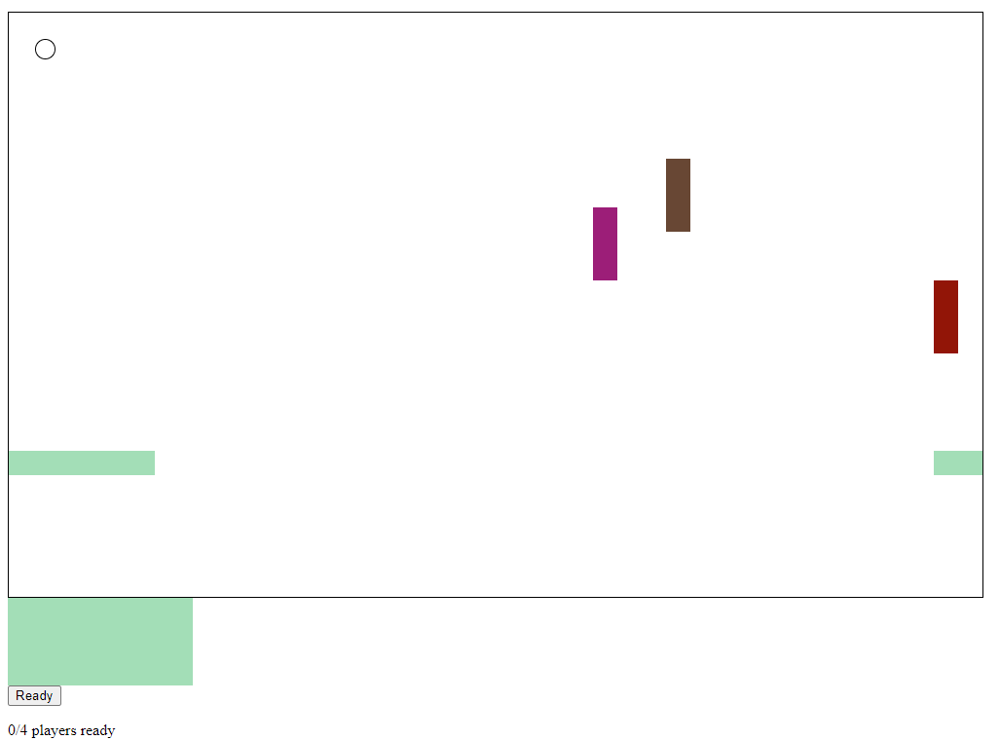

# Snake

This is a twist on the classic snake game, making it multiplayer. The application
will work for any number of players and the board will automatically resize. Right now,
it only works for local multiplayer but could easily be deployed on a server.
It does not require a central host, games will automatically start and cycle when
all players indicate they are ready.

